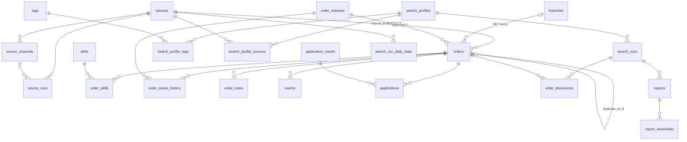

# JuniorMayWork — Проект бази даних v2.0

**Статус:** затверджений дизайн (джерело істини для міграцій 006–008).
Реалізовано фазами: A (міграція 006, адитивно), B (міграція 008, backfill
нормалізованих структур без ламання чинного коду), report_type (007),
ERD-ноди нових таблиць (009).

---

## 1. Принципи проєктування

1. **Ідентичність.** Всі PK нових таблиць — `BIGINT GENERATED ALWAYS AS IDENTITY`.
2. **Дві категорії значень:** стани автоматів (`search_runs.status`, `source_runs.outcome`) — CHECK-обмеження; користувацькі/видимі у UI (`orders.status`, `applications.result`) — lookup-таблиці з FK.
3. **Явна політика видалення для кожного FK** — CASCADE для дочірніх логів, SET NULL для необов'язкових посилань, RESTRICT для довідників.
4. **Темпоральність:** `created_at` скрізь; `updated_at` там, де рядок мутує; обидва — тригером `touch_updated_at()`.
5. **Нормалізація:** 3НФ для фактів; JSONB лише для сирого протоколу (`raw`, `meta`, `stats`, `payload`, `criteria`-надлишок).
6. **Індекс на кожен FK** + часткові індекси під реальні запити UI. Postgres не будує їх сам.
7. **Дублікати заборонені там, де це бізнес-правило:** `UNIQUE (source_id, external_id)`, `UNIQUE (search_run_id, order_id)`, `UNIQUE (report_search_run, report_type)`.

## 2. Доменна модель

| Домен | Таблиці | Відповідальність |
|---|---|---|
| Збір (radar) | sources, source_channels, source_runs | звідки і як збираємо, телеметрія прогонів |
| Каталог | branches, skills, orders, order_skills | вітки-ніші, замовлення, їх навички |
| Життєвий цикл | order_statuses, order_status_history, order_notes, events | стани, історія, нотатки, події |
| Робота із заявками | applications, application_results | подано/результат |
| Пошук | search_profiles, tags, search_profile_tags, search_profile_sources, search_runs, order_discoveries | критерії, прогони, що знайшли |
| Звітність | reports, report_downloads, search_run_daily_stats, audit_log | PDF-звіти, їх завантаження, агрегати, аудит |
| UI-метадані | schema_layouts, schema_nodes | розкладка ER-карти (позадоменні) |

## 3. Ключові архітектурні рішення

| Рішення | Було (v1) | Стало (v2) | Чому |
|---|---|---|---|
| Джерело замовлення | `orders.source TEXT` | `orders.source_id FK → sources` | референційна цілісність; `UNIQUE(source_id, external_id)` |
| Статуси | TEXT + лейбли у фронті | lookup `order_statuses` + FK RESTRICT | кольори/лейбли в даних, історична валідність |
| Критерії профілю | все в `criteria JSONB` | скалярні колонки + CHECK + JSONB для надлишку | типізація, обмеження |
| Навички | `orders.skills TEXT[]` | M:N `skills` + `order_skills` | нормальна форма, аналітика «попит за навичками» |
| Історія статусів | немає | `order_status_history` | who/when/what — база таймлайна UI |
| Нотатки | лише в applications | `order_notes` окремо | різні сутності життєвого циклу |
| Аудит grid CRUD | немає | `audit_log` | 10+ таблиць редагуються вручну — потрібен слід |
| Один звіт на тип | дублікати можливі | `UNIQUE (search_run_id, report_type)` | бізнес-правило |
| Індекси FK | 4 шт | 19+ шт + часткові | JOIN-и по FK без сканів |
| updated_at | без підтримки | тригери | чесні часові мітки |

## 4. Стан реалізації (міграції)

- **006_entity_integrity.sql** — довідники `order_statuses` (з seed, `won→offer`, `lost→rejected` у backfill), `application_results`, `skills`, `tags`; `orders.status_id` + backfill; `order_status_history`, `order_notes`, `audit_log`, `report_downloads`, `search_run_daily_stats`; FK-індекси; тригери `updated_at`; view `v_order_board`, `v_source_health`, `v_daily_intake`.
- **007_report_type.sql** — `reports.report_type ('run'|'summary')`.
- **008_normalization.sql** — Фаза B: seed `sources` з `DISTINCT orders.source`, `orders.source_id` + backfill (nullable до переходу Go-коду); `order_skills` M:N + словник skills + backfill з `unnest`; `search_profiles`: `interval_minutes`, `min/max_budget_cents`, `max_age_hours` + backfill з `criteria` JSONB (кастинги захищені regexp-ами).
- **009_schema_nodes_seed.sql** — ноди нових таблиць на ERD-мапі.

### Відкладені кроки (вимагають правок Go-коду в store)

1. Перехід читань/записів на `orders.source_id` (замість TEXT) і видалення дублюючої колонки після перевірки повноти.
2. Перенесення тегів на lookup-схему (`search_profile_tags` зараз має `tag` + `tag_type` TEXT; код у store/search_profiles.go пише туди напряму).
3. Прибрання `applications.order_title` (замінити join-ом).
4. `skills`/`order_skills` як канал запису в скрейпері (зараз порядок: TEXT[] канонічний, M:N — проєкція).

## 5. ER-діаграма (цільова)

## 6. View для UI

- `v_order_board` — борд замовлень з лейблами/кольорами статусів і назвою вітки.
- `v_source_health` — здоров'я джерел (останній прогін через LATERAL).
- `v_daily_intake` — добові надходження і частка дублікатів.
