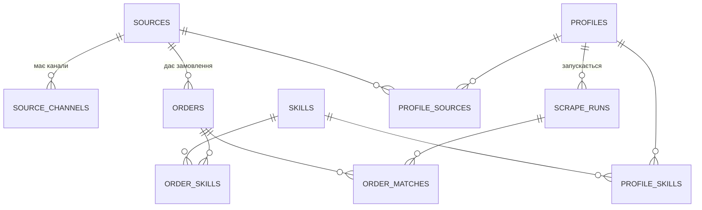

# JuniorMayWork — Проєкт бази даних v4

**Статус:** затверджений дизайн — джерело істини для міграції `backend/migrations/010_v4_rebuild.sql`.
Замінює `DB_DESIGN_V2.md` повністю.

## Принципи v4

1. **Один користувач, локальна прога** — жодних users, заявок, подій, нотаток.
2. **12 таблиць-фактів + 6 звітних view-ів** («вихідні таблиці» для звітів і діаграм).
3. **Кожен FK — з явною політикою видалення:** CASCADE (дочірнє гине з батьком),
   SET NULL (не обов'язкові посилання), RESTRICT (довідники не видаляємо під живими даними).
4. **Статуси — CHECK** (`new/seen/won/lost/archived`): для одного юзера lookup-таблиця — надмірність.
5. **Дедуп:** `UNIQUE (source_id, source_message_id)` — той самий постинг двічі не тягнемо.
6. **Архів зниклих — у БД** (`archived_orders`, снапшот JSONB), не JSON-файл: можна запитати «що пропало за тиждень».

## ER-діаграма



Схема потоків:

1. **Збір:** `sources` → скрейпер → `orders` (+ `order_skills`), дедуп через `UNIQUE(source_id, source_message_id)`.
2. **Пошук:** `profiles` (+ `profile_skills`, `profile_sources`) → `scrape_runs` → `order_matches` → які `orders` збіглись.
3. **Архів:** зникле з джерела замовлення переноситься в `archived_orders` і видаляється з `orders` (ознака зникнення — `orders.last_seen_at` давніше за поріг).

## Розкладка таблиць

| # | Таблиця | Призначення |
|---|---|---|
| 1 | `sources` | джерела збору (api/telegram/rss/html) |
| 2 | `source_channels` | TG-канали усередині джерела |
| 3 | `skills` | довідник навичок |
| 4 | `orders` | ядро: замовлення |
| 5 | `order_skills` | M:N замовлення ↔ навички |
| 6 | `profiles` | збережені критерії пошуку (мова, макс. бюджет, дата з—по, ліміт) |
| 7 | `profile_skills` | M:N профіль ↔ навички |
| 8 | `profile_sources` | M:N профіль ↔ джерела |
| 9 | `scrape_runs` | лог запусків профілю |
| 10 | `order_matches` | M:N запуск ↔ знайдені замовлення |
| 11 | `archived_orders` | снапшот зниклих замовлень |
| 12 | `app_settings` | налаштування проги (ключ-значення) |

## Мапа v2 → v4

| Було (v2) | Стало (v4) |
|---|---|
| `branches` (вітки з ключовими словами) | `profiles` + `profile_skills` + `profile_sources` (критерії, не ручні групи) |
| `orders.status` TEXT + `status_id` FK | лише `status` з CHECK |
| `orders.skills` TEXT[] + `order_skills` | лише M:N `order_skills` |
| `orders.source` TEXT + `source_id` | лише `source_id` FK |
| `events` (live-фід) | прибрано |
| `applications`, `order_notes`, `order_status_history` | прибрано (один юзер, заявки не трекаємо в БД) |
| `search_profiles` + `search_runs` + `order_discoveries` | `profiles` + `scrape_runs` + `order_matches` |
| `reports` / `report_exports` / `report_downloads` | view-и: звіти обчислюються, не зберігаються |
| JSON-архів на диску | таблиця `archived_orders` |
| `schema_nodes` (ERD у БД) | ERD у фронті (`SchemaMap.jsx`) |

## Звітний шар (view-и)

| View | Що дає |
|---|---|
| `v_orders_full` | широка картка замовлення (джерело, навички масивом) — експорт/PDF |
| `v_status_summary` | донат «за статусами» |
| `v_skill_demand` | попит за навичками + середній бюджет |
| `v_daily_dynamics` | динаміка по днях для лінійних графіків |
| `v_profile_stats` | ефективність профілів |
| `v_archive_history` | що і коли зникало |

Приклади:

```sql
-- звіт за місяць, готовий до заливки в PDF
SELECT * FROM v_orders_full
WHERE first_seen_at >= '2026-09-01' AND first_seen_at < '2026-10-01';

-- топ-5 навичок за попитом
SELECT * FROM v_skill_demand ORDER BY orders_count DESC LIMIT 5;

-- кандидати в архів
SELECT id, title FROM orders WHERE last_seen_at < now() - interval '7 days';
```

## Наслідки для коду (етап 2)

- `store`: CRUD замовлень/профілів на нових колонках; дедуп через `UNIQUE(source_id, source_message_id)`.
- `scraper`: upsert із `last_seen_at`; зниклі → перенесення в `archived_orders`.
- `reportgen`: читає з view-ів (`SELECT * FROM v_orders_full ...`).
- Фронт: донати/графіки з view-ів, ERD-мапа під 12 таблиць.
