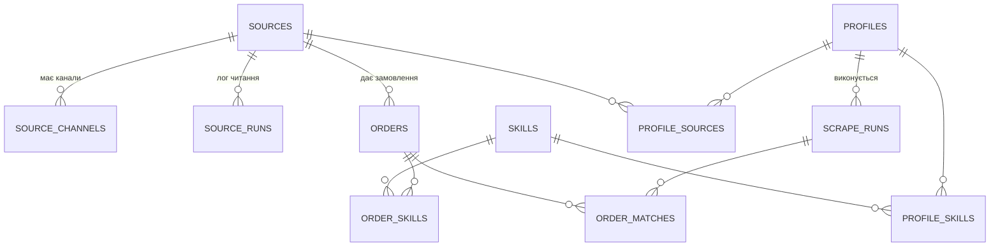

# JuniorMayWork — Проєкт бази даних v4

**Статус:** затверджений дизайн — джерело істини для міграцій `010–012`.

## Принципи v4

1. Один користувач, локальна прога — без users, заявок, подій і нотаток.
2. **13 таблиць-фактів + 7 звітних view-ів.**
3. Усі FK мають явний `ON DELETE`; дані звітів беруться із view-ів, не з копій.
4. Статуси замовлень — CHECK: `new/seen/won/lost/archived`.
5. Дедуп: `UNIQUE(source_id, source_message_id)`.
6. Опис замовлення зберігається в `orders.description` (міграція 011).

## ER-діаграма

## 13 таблиць

| # | Таблиця | Призначення |
|---|---|---|
| 1 | `sources` | джерела збору |
| 2 | `source_channels` | Telegram-канали джерела |
| 3 | `source_runs` | технічний лог здоров'я конкретного джерела |
| 4 | `skills` | довідник навичок |
| 5 | `orders` | замовлення: назва, **опис**, статус, бюджет, дати |
| 6 | `order_skills` | M:N orders ↔ skills |
| 7 | `profiles` | збережені критерії пошуку |
| 8 | `profile_skills` | M:N profiles ↔ skills |
| 9 | `profile_sources` | M:N profiles ↔ sources |
| 10 | `scrape_runs` | результат виконання профілю |
| 11 | `order_matches` | M:N запуск профілю ↔ знайдені замовлення |
| 12 | `archived_orders` | снапшот зниклих замовлень |
| 13 | `app_settings` | налаштування проги |

## Чому є два види запусків

| Таблиця | Питання, на яке відповідає |
|---|---|
| `source_runs` | «Djinni зараз працює? Яка була остання помилка? Скільки постингів він віддав?» |
| `scrape_runs` | «Коли профіль React до $100 запускався? Які замовлення він підібрав?» |

Це не дублювання: перша таблиця описує технічний транспорт, друга — бізнес-результат твого фільтра.

## View-и для звітів

- `v_orders_full`, `v_status_summary`, `v_skill_demand`, `v_daily_dynamics`, `v_profile_stats`, `v_archive_history` — з міграції 010.
- `v_source_health` — з міграції 012; показує останній результат по кожному джерелу.
